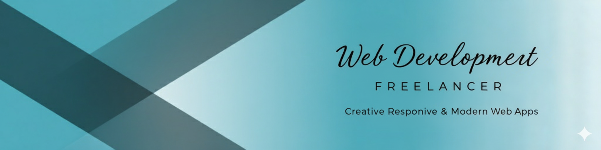

 <!--  INTRO SECTION -->
  <h1 align="center" style="color:#00FFFF;">Hi 👋, I'm Uroosa Ghulam Mohiuddin</h1>

  

  

  <h2 align="center" style="color:#00FFFF;"> ✨Explore My Coding World✨</h2>
  <h4 align="center" style="color: #00FFFF;">Frontend Developer | SMIT Trainee | Passionate about Clean Code & Creative Design</h4>

<!--  BUTTON STATS -->
<h3 align="center" style="color:#00FFFF;">  Profile Highlights</h3>

  
  
  
  
  

  
  
  
  

<!--  SKILLS SECTION -->
<h3 align="center" style="color:#00FFFF;"> Skills</h3>

  

    
    
    
    
  

<!--  LANGUAGES & TOOLS -->
<h3 align="center" style="color:#00FFFF;"> Languages & Tools</h3>

  
  
  
  

<!--  CONNECT SECTION -->
<h3 align="center" style="color:#00FFFF;"> Connect With Me</h3>

  
  
  

 

<!--  MOST USED LANGUAGES -->
<h3 align="center" style="color:#00FFFF;"> Most Used Languages</h3>

  

    
  

<!--  GITHUB STREAK SECTION -->
<h3 align="center" style="color:#00FFFF;">GitHub Streak</h3>

  

    <h3 style="color:#00FFFF; margin-bottom:15px;">GitHub Streak Stats</h3>
    
  

<!--  GITHUB STATS -->
<h3 align="center" style="color:#00FFFF;"> Uroosa’s GitHub Stats</h3>

  

    
  

<!-- Footer Wave -->
 

  

